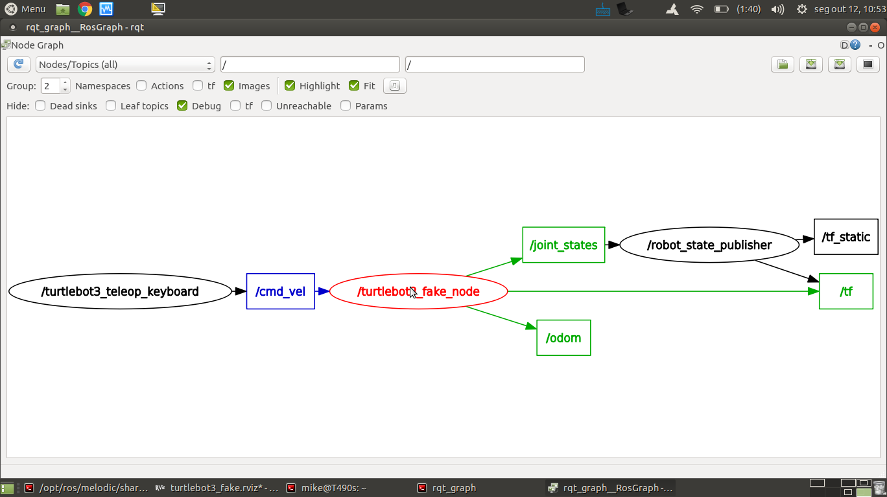
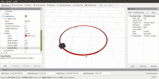
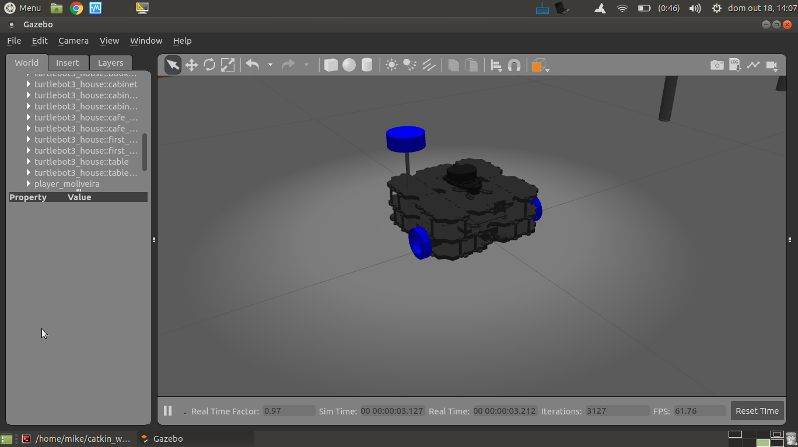
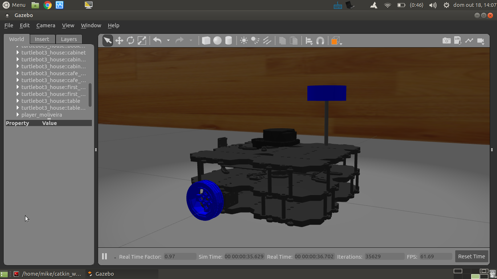
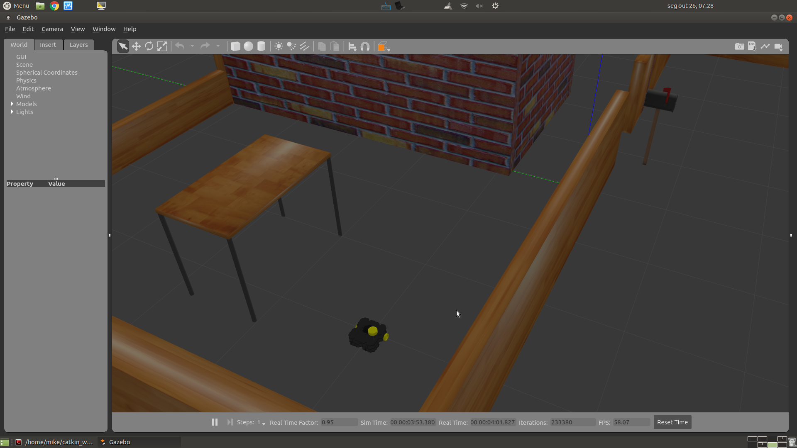
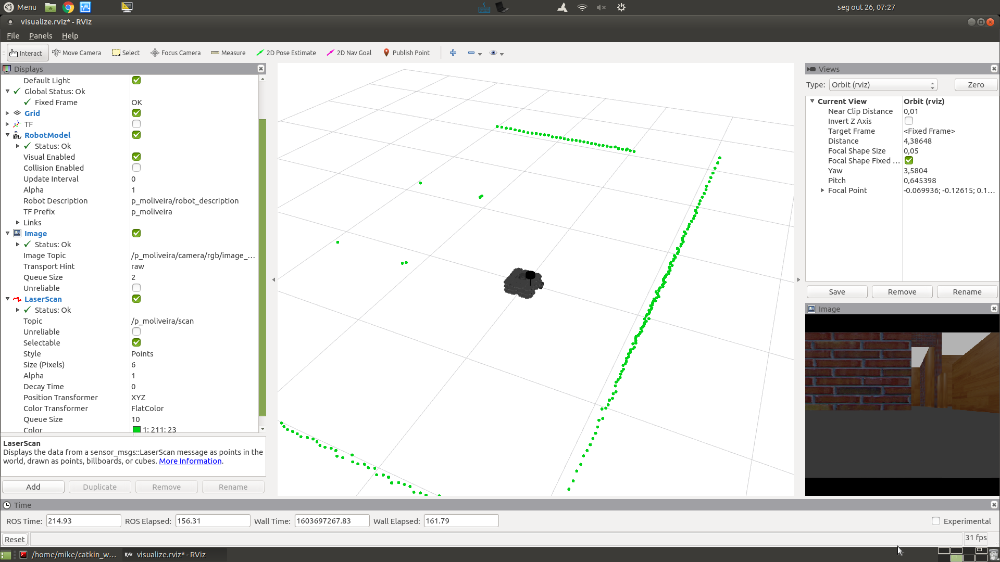
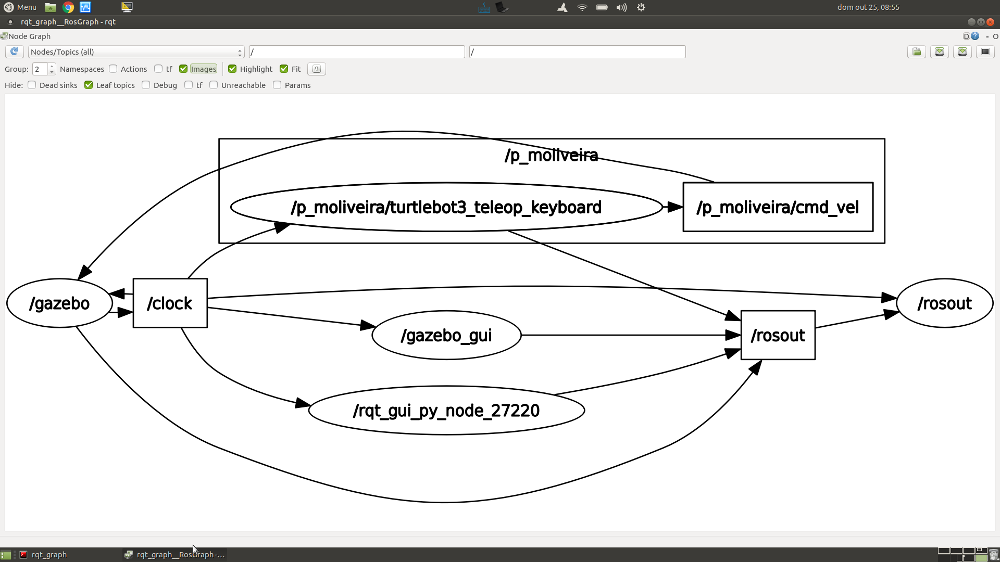
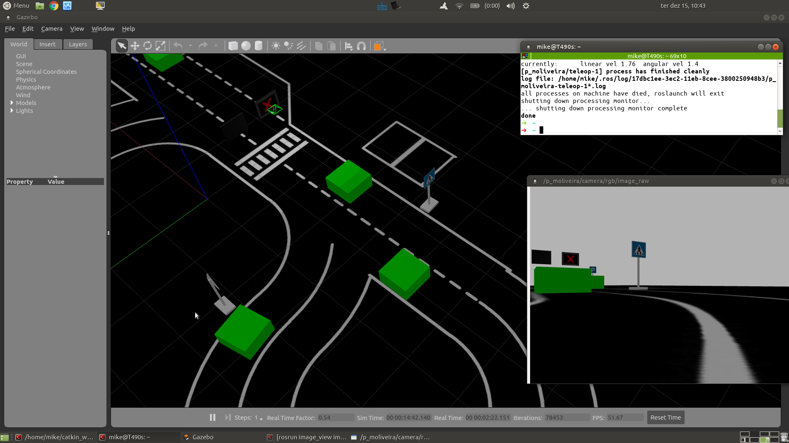

= Parte 12 - PARI

Miguel Riem Oliveira <mriem@ua.pt>
2020-2021

// Instruções especiais para o asciidoc usar icons no output
:icons: html5
:iconsdir: /etc/asciidoc/images/icons
:stem: latexmath

.Sumário
-------------------------------------------------------------
Modelo cinemático diferencial
Simulação usando o gazebo
Turtlebot3
Criação dos packages para o jogo Team Hunt
-------------------------------------------------------------

[WARN]
================
Explore o site to turtlebot3 antes da aula para se familizar com o robô e as várias ferramentas.

https://emanual.robotis.com/docs/en/platform/turtlebot3/overview/

Outro link útil é: https://automaticaddison.com/how-to-launch-the-turtlebot3-simulation-with-ros/?fbclid=IwAR2l6Jd1E4GLdlt_ClWRMoyh8Rl8SNGxdPIyjIvgg1mOeBn-Xn4si9XrP80
================

Pretende-se utilizar o Turtlebot3 em modo simulado. O modo de simulação implica que
o robô real seja substituido por um programa que, quando em execução, se comporta como o robô real.
Obviamente que esse programa (o simulador) pode ter mais ou menos funcionalidades, imitando mais ou menos detalhadamente o robô real.

[WARN]
================
Vamos em todos os exemplos usar o modelo do turtlebot3 chamado **waffle_pi**.

Adicione ao seu _.bashrc_ uma variável que contenha essa informação, como explicado https://emanual.robotis.com/docs/en/platform/turtlebot3/export_turtlebot3_model/[aqui].
================

Exercício 1 - Simulador simples
-------------------------------

Neste primeiro exercício vamos utilizar o http://wiki.ros.org/turtlebot3_fake[turtlebot3_fake], que é um nó que ao executar recebe mensagens de comando
(http://docs.ros.org/api/geometry_msgs/html/msg/Twist.html[geometry_msgs/Twist]) e publica mensagens de http://docs.ros.org/api/sensor_msgs/html/msg/JointState.html[sensor_msgs/JointState] com a posição das rodas a cada instante.

Este nó calcula a posição atual do robô em função de um modelo matematico da http://rossum.sourceforge.net/papers/DiffSteer/DiffSteer.html[cinemática diferencial do robô]. Por outras palavras, calcula o deslocamento do robô a cada instante e publica a posição atual
em mensagens de transformações (http://docs.ros.org/api/tf2_msgs/html/msg/TFMessage.html[tf2_msgs/TFMessage]).

[.text-center]
.Grafo de computação.

Para lançar o nó e o Rviz, execute:

  roslaunch turtlebot3_fake turtlebot3_fake.launch

e depois, para lançar a teleoperação execute:

  roslaunch turtlebot3_teleop turtlebot3_teleop_key.launch

Usando a operação manual, faça o robô andar em círculos como indicado no vídeo.

[.text-center]
.Comando manual do turtlebot3 - andar em circulos.

Exercício 2 - Simulador Gazebo
------------------------------

A segunda forma de simular um robô é utilizando um simulador genérico como o http://gazebosim.org/[gazebo].
O gazebo é um simulador capaz de simular qualquer robô, partindo de uma descrição do mesmo baseada no formato URDF (ou outro bastante similar).
O gazebo tem fucionalidades avançadas como simulação de sensores, i.e., consegue gerar dados de sensors em função do sensor e sua localização na cena.
Outra funcionalidade é o motor físico.

Faça os exemplos da secção https://emanual.robotis.com/docs/en/platform/turtlebot3/simulation/#ros-1-simulation[TurtleBot3 Simulation using Gazebo].

Os launch files para o lançamento da simulação do turtlebot3 em gazebo são muito parecidos.
Analizemos o caso do https://github.com/ROBOTIS-GIT/turtlebot3_simulations/blob/master/turtlebot3_gazebo/launch/turtlebot3_house.launch[turtlebot3_house.launch].

.turtlebot3_house.launch
[source,xml]
-----------------------------------------------------------------
<launch>
    <!--Bloco 1: argumentos do launch file.-->
    <arg name="model" default="$(env TURTLEBOT3_MODEL)" doc="model type [burger, waffle, waffle_pi]"/>
    <arg name="x_pos" default="-3.0"/>
    <arg name="y_pos" default="1.0"/>
    <arg name="z_pos" default="0.0"/>

    <!--Bloco 2: Criação de um world om gazebo.-->
    <include file="$(find gazebo_ros)/launch/empty_world.launch">
        <arg name="world_name" value="$(find turtlebot3_gazebo)/worlds/turtlebot3_house.world"/>
        <arg name="paused" value="false"/>
        <arg name="use_sim_time" value="true"/>
        <arg name="gui" value="true"/>
        <arg name="headless" value="false"/>
        <arg name="debug" value="false"/>
    </include>

    <!--Bloco 3: Carregamento do xacro do robot para o parâmetro robot_description.-->
    <param name="robot_description" command="$(find xacro)/xacro --inorder $(find turtlebot3_description)/urdf/turtlebot3_$(arg model).urdf.xacro" />

    <!--Bloco 4: Spawning (criação instantânea) do robô definido pela descrição anteriormente carregada para o robot_description, para uma posição específica da cena. -->
    <node name="spawn_urdf" pkg="gazebo_ros" type="spawn_model" args="-urdf -model turtlebot3 -x $(arg x_pos) -y $(arg y_pos) -z $(arg z_pos) -param robot_description" />
</launch>
-----------------------------------------------------------------

Existem 4 blocos principais:

    1. O primeiro é o de definição de argumentos de entrada do launch file;
    2. O segundo bloco é o de lançamento do gazebo e criação de uma cena;
    3. O terceiro bloco carrega a descrição do robô para um parâmetro ros;
    4. O quarto bloco inicializa o robô algures algures no mundo do gazebo.

No segundo bloco é chamado um outro launch file denominado https://github.com/ros-simulation/gazebo_ros_pkgs/blob/kinetic-devel/gazebo_ros/launch/empty_world.launch[empty_world.launch], que inicia os programas gazebo servidor e cliente (a parte gráfica).

Este launch file contém o argumento https://github.com/ros-simulation/gazebo_ros_pkgs/blob/a63566be22361fa1f02ebcca4a9857d233e1c2ac/gazebo_ros/launch/empty_world.launch#L18[world_name],
que é o que define a cena a ser usada. Em gazebo, uma cena é definida por um ficheiro chamado no standard http://sdformat.org/spec?ver=1.7&elem=world[scene_description_format] (extensão _.sdf_ ou _.world_).
Este formato é semelhante ao já estudado http://wiki.ros.org/urdf[urdf] (também é em formato _xml_) mas a informação que contem descreve não apenas o robô mas toda a cena, não só os objetos físicos como a casa, mas também
a luz ambiente, o motor físico a usar etc. Em baixo o exemplo do ficheiro que define a cena da casa:

.turtlebot3_house.world
[source,xml]
-----------------------------------------------------------------
<sdf version='1.4'>
  <world name='default'>
    <!-- A global light source -->
    <include>
      <uri>model://sun</uri>
    </include>

    <!-- A ground plane -->
    <include>
      <uri>model://ground_plane</uri>
    </include>

    <physics type="ode">
      <real_time_update_rate>1000.0</real_time_update_rate>
      <max_step_size>0.001</max_step_size>
      <real_time_factor>1</real_time_factor>
      <ode>
        <solver>
          <type>quick</type>
          <iters>150</iters>
          <precon_iters>0</precon_iters>
          <sor>1.400000</sor>
          <use_dynamic_moi_rescaling>1</use_dynamic_moi_rescaling>
        </solver>
        <constraints>
          <cfm>0.00001</cfm>
          <erp>0.2</erp>
          <contact_max_correcting_vel>2000.000000</contact_max_correcting_vel>
          <contact_surface_layer>0.01000</contact_surface_layer>
        </constraints>
      </ode>
    </physics>

    <!-- A turtlebot symbol -->
    <include>
      <uri>model://turtlebot3_house</uri>
    </include>

    <scene>
      <ambient>0.4 0.4 0.4 1</ambient>
      <background>0.7 0.7 0.7 1</background>
      <shadows>true</shadows>
    </scene>

    <gui fullscreen='0'>
      <camera name='user_camera'>
        <pose>0.0 0.0 17.0 0 1.5708 0</pose>
        <view_controller>orbit</view_controller>
      </camera>
    </gui>
  </world>
</sdf>
-----------------------------------------------------------------

O terceiro bloco do  _turtlebot3_house.launch_ é o que carrega o xacro com a descrição do robô para o parâmetro _robot_description_.
O _xacro_ do turtlebot3 é o https://github.com/ROBOTIS-GIT/turtlebot3/blob/master/turtlebot3_description/urdf/turtlebot3_waffle_pi.urdf.xacro[seguinte]:

.turtlebot3_waffle_pi.urdf.xacro
[source,xml]
-----------------------------------------------------------------
<?xml version="1.0" ?>
<robot name="turtlebot3_waffle_pi" xmlns:xacro="http://ros.org/wiki/xacro">
  <xacro:include filename="$(find turtlebot3_description)/urdf/common_properties.xacro"/>
  <xacro:include filename="$(find turtlebot3_description)/urdf/turtlebot3_waffle_pi.gazebo.xacro"/>

  <link name="base_footprint"/>

  <joint name="base_joint" type="fixed">
    <parent link="base_footprint"/>
    <child link="base_link" />
    <origin xyz="0 0 0.010" rpy="0 0 0"/>
  </joint>

  <link name="base_link">
    <visual>
      <origin xyz="-0.064 0 0.0" rpy="0 0 0"/>
      <geometry>
        <mesh filename="package://turtlebot3_description/meshes/bases/waffle_pi_base.stl" scale="0.001 0.001 0.001"/>
      </geometry>
      <material name="light_black"/>
    </visual>

    <collision>
      <origin xyz="-0.064 0 0.047" rpy="0 0 0"/>
      <geometry>
        <box size="0.266 0.266 0.094"/>
      </geometry>
    </collision>

    <inertial>
      <origin xyz="0 0 0" rpy="0 0 0"/>
      <mass value="1.3729096e+00"/>
      <inertia ixx="8.7002718e-03" ixy="-4.7576583e-05" ixz="1.1160499e-04"
               iyy="8.6195418e-03" iyz="-3.5422299e-06"
               izz="1.4612727e-02" />
    </inertial>
  </link>

  <joint name="wheel_left_joint" type="continuous">
    <parent link="base_link"/>
    <child link="wheel_left_link"/>
    <origin xyz="0.0 0.144 0.023" rpy="-1.57 0 0"/>
    <axis xyz="0 0 1"/>
  </joint>

  <link name="wheel_left_link">
    <visual>
      <origin xyz="0 0 0" rpy="1.57 0 0"/>
      <geometry>
        <mesh filename="package://turtlebot3_description/meshes/wheels/left_tire.stl" scale="0.001 0.001 0.001"/>
      </geometry>
      <material name="dark"/>
    </visual>

    <collision>
      <origin xyz="0 0 0" rpy="0 0 0"/>
      <geometry>
        <cylinder length="0.018" radius="0.033"/>
      </geometry>
    </collision>

    <inertial>
      <origin xyz="0 0 0" />
      <mass value="2.8498940e-02" />
      <inertia ixx="1.1175580e-05" ixy="-4.2369783e-11" ixz="-5.9381719e-09"
               iyy="1.1192413e-05" iyz="-1.4400107e-11"
               izz="2.0712558e-05" />
      </inertial>
  </link>

  <joint name="wheel_right_joint" type="continuous">
    <parent link="base_link"/>
    <child link="wheel_right_link"/>
    <origin xyz="0.0 -0.144 0.023" rpy="-1.57 0 0"/>
    <axis xyz="0 0 1"/>
  </joint>

  <link name="wheel_right_link">
    <visual>
      <origin xyz="0 0 0" rpy="1.57 0 0"/>
      <geometry>
        <mesh filename="package://turtlebot3_description/meshes/wheels/right_tire.stl" scale="0.001 0.001 0.001"/>
      </geometry>
      <material name="dark"/>
    </visual>

    <collision>
      <origin xyz="0 0 0" rpy="0 0 0"/>
      <geometry>
        <cylinder length="0.018" radius="0.033"/>
      </geometry>
    </collision>

    <inertial>
      <origin xyz="0 0 0" />
      <mass value="2.8498940e-02" />
      <inertia ixx="1.1175580e-05" ixy="-4.2369783e-11" ixz="-5.9381719e-09"
               iyy="1.1192413e-05" iyz="-1.4400107e-11"
               izz="2.0712558e-05" />
      </inertial>
  </link>

  <joint name="caster_back_right_joint" type="fixed">
    <parent link="base_link"/>
    <child link="caster_back_right_link"/>
    <origin xyz="-0.177 -0.064 -0.004" rpy="-1.57 0 0"/>
  </joint>

  <link name="caster_back_right_link">
    <collision>
      <origin xyz="0 0.001 0" rpy="0 0 0"/>
      <geometry>
        <box size="0.030 0.009 0.020"/>
      </geometry>
    </collision>

    <inertial>
      <origin xyz="0 0 0" />
      <mass value="0.005" />
      <inertia ixx="0.001" ixy="0.0" ixz="0.0"
               iyy="0.001" iyz="0.0"
               izz="0.001" />
    </inertial>
  </link>

  <joint name="caster_back_left_joint" type="fixed">
    <parent link="base_link"/>
    <child link="caster_back_left_link"/>
    <origin xyz="-0.177 0.064 -0.004" rpy="-1.57 0 0"/>
  </joint>

  <link name="caster_back_left_link">
    <collision>
      <origin xyz="0 0.001 0" rpy="0 0 0"/>
      <geometry>
        <box size="0.030 0.009 0.020"/>
      </geometry>
    </collision>

    <inertial>
      <origin xyz="0 0 0" />
      <mass value="0.005" />
      <inertia ixx="0.001" ixy="0.0" ixz="0.0"
               iyy="0.001" iyz="0.0"
               izz="0.001" />
    </inertial>
  </link>

  <joint name="imu_joint" type="fixed">
    <parent link="base_link"/>
    <child link="imu_link"/>
    <origin xyz="0.0 0 0.068" rpy="0 0 0"/>
  </joint>

  <link name="imu_link"/>

  <joint name="scan_joint" type="fixed">
    <parent link="base_link"/>
    <child link="base_scan"/>
    <origin xyz="-0.064 0 0.122" rpy="0 0 0"/>
  </joint>

  <link name="base_scan">
    <visual>
      <origin xyz="0 0 0.0" rpy="0 0 0"/>
      <geometry>
        <mesh filename="package://turtlebot3_description/meshes/sensors/lds.stl" scale="0.001 0.001 0.001"/>
      </geometry>
      <material name="dark"/>
    </visual>

    <collision>
      <origin xyz="0.015 0 -0.0065" rpy="0 0 0"/>
      <geometry>
        <cylinder length="0.0315" radius="0.055"/>
      </geometry>
    </collision>

    <inertial>
      <mass value="0.114" />
      <origin xyz="0 0 0" />
      <inertia ixx="0.001" ixy="0.0" ixz="0.0"
               iyy="0.001" iyz="0.0"
               izz="0.001" />
    </inertial>
  </link>

  <joint name="camera_joint" type="fixed">
    <origin xyz="0.073 -0.011 0.084" rpy="0 0 0"/>
    <parent link="base_link"/>
    <child link="camera_link"/>
  </joint>

  <link name="camera_link">
    <collision>
      <origin xyz="0.005 0.011 0.013" rpy="0 0 0"/>
      <geometry>
        <box size="0.015 0.030 0.027"/>
      </geometry>
    </collision>
  </link>

  <joint name="camera_rgb_joint" type="fixed">
    <origin xyz="0.003 0.011 0.009" rpy="0 0 0"/>
    <parent link="camera_link"/>
    <child link="camera_rgb_frame"/>
  </joint>
  <link name="camera_rgb_frame"/>

  <joint name="camera_rgb_optical_joint" type="fixed">
    <origin xyz="0 0 0" rpy="-1.57 0 -1.57"/>
    <parent link="camera_rgb_frame"/>
    <child link="camera_rgb_optical_frame"/>
  </joint>
  <link name="camera_rgb_optical_frame"/>

</robot>
-----------------------------------------------------------------

Exercício 3 - Criação de um robô **player**
-------------------------------------------

Pretende-se criar um robô baseado no _turtlebot3_ modelo _waffle_pi_ para fazer um jogo que será apresentado posteriormente.

[WARN]
================
As regras do jogo definem que os jogadores (os robôs) deverão ter a cor da equipa a que pertencem, e que essa cor deve ser visível de qualquer ângulo à volta do robô.
================

Neste exercício pretende-se criar um robô baseado no _turtlebot3_ _waffle_pi_. As alterações a ser feitas à base do turtlebot3 visam cumprir a regra de ter uma cor à vista no robô.

[WARN]
================
Vamos usar a seguinte regra para nomear os elementos de cada robô:

**p**_<**f**irstname><**lastname**>

Devem ser consideradas as letras a bold.
Assim, a letra **p** é de _player_, depois é acrecentada a primeira letra do primeiro nome (**f**), seguida do último nome completo (**lastname**).

No caso do jogador se chamar _Miguel Riem Oliveira_, o nome de jogador fica:

**p_moliveira**

De agora em diante deve substituir o padrão _<player_name>_ pelo nome do seu jogador.
================

Cada aluno irá desenvolver um robô. Assim, e para evitar colisões, cada robô deverá ter um nome específico.
O primeiro passo é a criação do package que irá conter os ficheiros urdf e xacro com a descrição do nosso robô.

Ex 3a)
~~~~~

Crie um novo _ros package_ denominado **<player_name>_description**. Nesse package crie uma pasta urdf e coloque lá dentro os ficheiros urdf e xacro de que vai necessitar.

Crie (ou copie do turtlebot3_description) os xacros necessários de modo a que o seu robô tenha elementos com a cor da sua equipa, com descrito acima.
Para alterar a cor de elementos deve ver http://gazebosim.org/tutorials?tut=ros_urdf[este tutorial].

[TIP]
================
De acordo com a filosofia do ROS, deve-se reaproveitar o máximo o código já feito.
Assim, deve copiar apenas os ficheiros do package _turtlebot3_description/urdf_ que vai alterar. Todos os outros que ficam inalterados deverão ser importados do pacote ROS original.
================

Em baixo um sumário dos ficheiro presentes no package _p_moliveira_description_.

.package p_moliveira_description.
[source,bash]
-----------------------------------------------------------------
p_moliveira_description
├── CMakeLists.txt
├── package.xml
├── src
└── urdf
    ├── p_moliveira.gazebo.xacro
    └── p_moliveira.urdf.xacro
-----------------------------------------------------------------

Ex 3b)
~~~~~

Crie um novo ros package chamado **<player_name>_bringup** onde coloca dois launch files.
Um launch file deverá lançar o gazebo (o bloco 2 do turtlebot3_house.launch
), enquanto que o outro deverá fazer o _spawn_ do robô (blocos 1, 3 e 4 do turtlebot3_house.launch
).

Em baixo um sumário dos ficheiro presentes no package _p_moliveira_bringup.

.package p_moliveira_bringup.
[source,bash]
-----------------------------------------------------------------
p_moliveira_bringup
├── CMakeLists.txt
├── launch
│   ├── bringup_gazebo.launch
│   └── spawn.launch
├── package.xml
└── src
-----------------------------------------------------------------

As imagens em baixo mostram o robô **p_moliveira**. Neste caso optou-se por colocar as rodas do robô a azul, e acrescentar uma "antena" com um cilindro da mesma cor.

[.text-center]
.o robô player_oliveira baseado no turtlebot.

[.text-center]
.o robô player_oliveira baseado no turtlebot.

Exercício 4 - Pushing _<player_name>_ namespace
-----------------------------------------------

Para evitar colisões com outros jogadores é necessário que os launch files gerem tópicos, serviços, tfs, etc sob o namespace <player_name>.
Quer isto dizer que, por exemplo:

1. o sistema de coordenadas tf _base_link_ deverá ficar _<player_name>/base_link_
2. o tópico para comando de velocidade _cmd_vel_ deverá ficar _<player_name>/cmd_vel_
3. quaisquer serviços que existem devem também estar sob o namespace do _<player_name>_

Verifique que isto ocorre e altere os ficheiros do exercício anterior para garantir este ponto.

Exercício 5 - Configuração do RVIZ para visualização do robot
-------------------------------------------------------------

O RViz é um visualizador de mensagens ROS. Neste caso, o RViz irá funcionar como uma janela para o que cada robô vê, ao contrário do Gazebo que
contem toda a informação de todos os robôs.

Pretende-se criar um **visualize.launch** dentro do package _<player_name>_bringup_, que execute o rviz
carregando uma configuração pré-gravada.

.turtlebot3_house.launch
[source,xml]
-----------------------------------------------------------------
<launch>
    <!-- Launch rviz, loading configuration file -->
    <node name="rviz" pkg="rviz" type="rviz"
          args="--display-config $(find p_moliveira_bringup)/config/visualize.rviz" required="false"/>
</launch>
-----------------------------------------------------------------

Ex 5a
~~~~~

Configure o display **RobotModel** no RViz.

[TIP]
================
Uma vez que os parâmetros, tópicos e tfs estão sob o namespace do robô,
é necessário configurar o valor dos parâmetros para obter uma correta visualização.
================

Ex 5b
~~~~~

Configure um display **Image** para visualização das imagens (simuladas) da câmara.

Ex 5c
~~~~~

Configure um display **LaserScan** para visualização das dados (simulados) da Lidar.

[.text-center]
.Gazebo com o robô dentro de uma casa

[.text-center]
.Rviz com a informação adquirida pelo robô mostrado acima.

Exercício 6 - player teleop
---------------------------

O robô lançado no exercício anterior pode ser conduzido manualmente com o teleop usando o comando:

  roslaunch turtlebot3_teleop turtlebot3_teleop_key.launch

Crie no package _<player_name>_bringup_ um **teleop.launch** the faça a teleoperação do seu robô.

[TIP]
================
Pode também conduzir o seu robô com um comando da playstation ou xbox, ou mesmo do seu telefone android. Consulte https://emanual.robotis.com/docs/en/platform/turtlebot3/teleoperation/#teleoperation[estas instruções] e se quiser aumente o launch file para, com argumentos de entrada, ser possível definir o modo de teleoperação.
================

O grafo de computação do exercício anterior mostra que o package _turtlebot3_teleop_keyboard_ envia mensagens para o _gazebo_
no tópico _/p_moliveira/cmd_vel_. Executando o comando:

[.text-center]
.Grafo de computação do package teleop.

    rostopic type /p_moliveira/cmd_vel

e a resposta será que essas mensagens são do tipo _geometry_msgs/Twist_.
O package http://wiki.ros.org/geometry_msgs[geometry_msgs] disponibiliza mensagens para várias primitivas geométricas, tais como pontos, vectores, poses, etc.
A mensagem _Twist_ expressa um vetor de velocidade com as duas componentes linear e angular.

.geometry_msgs/Twist
[source,msg]
-----------------------------------------------------------------
# This expresses velocity in free space broken into its linear and angular parts.
Vector3  linear
Vector3  angular
-----------------------------------------------------------------

Uma vez que estamos a falar de um vetor de velocidade a 2D, para mover o robô é necessário explicitar apenas a _componente x_ da velocidade linear e
a _componente z_ da velocidade angular.

Um exemplo de uma mensagem enviada pelo teleop:

.exemplo de mensagem cmd_vel para turtlebot3
[source,bash]
-----------------------------------------------------------------
linear:
  x: 0.21
  y: 0.0
  z: 0.0
angular:
  x: 0.0
  y: 0.0
  z: 1.82
-----------------------------------------------------------------

Pode também publicar mensagens de comando do terminal:

.exemplo de publicação de cmd_vel usando o rostopic pub
[source,bash]
-----------------------------------------------------------------
 rostopic pub /p_moliveira/cmd_vel geometry_msgs/Twist "linear:
  x: 0.0
  y: 0.0
  z: 1000.0
angular:
  x: 0.0
  y: 0.0
  z: 100.0" --rate 10
-----------------------------------------------------------------

Exercício 7 - Reorganização dos ficheiros de descrição do robô
--------------------------------------------------------------

Como preparação do exercício seguinte, sugere-se a separação do ficheiro _<player_name>.gazebo.xacro_ em vários ficheiros.
Nomeadamente, a componente do controlador deverá estar num segundo ficheiro chamado _ros_diff_drive.gazebo.xacro_ (o nome do controlador do Gazebo), que terá o seguinte conteúdo:

[source,xml]
--------------------------------------------------------
<gazebo>
    <plugin name="turtlebot3_waffle_pi_controller" filename="libgazebo_ros_diff_drive.so">
      <commandTopic>cmd_vel</commandTopic>
      <odometryTopic>odom</odometryTopic>
      <odometryFrame>odom</odometryFrame>
      <odometrySource>world</odometrySource>
      <publishOdomTF>false</publishOdomTF>
      <!--      <publishOdomTF>true</publishOdomTF>-->
      <robotBaseFrame>base_footprint</robotBaseFrame>
      <publishWheelTF>false</publishWheelTF>
      <publishTf>true</publishTf>
      <publishWheelJointState>true</publishWheelJointState>
      <legacyMode>false</legacyMode>
      <updateRate>30</updateRate>
      <leftJoint>wheel_left_joint</leftJoint>
      <rightJoint>wheel_right_joint</rightJoint>
      <wheelSeparation>0.287</wheelSeparation>
      <wheelDiameter>0.066</wheelDiameter>
      <wheelAcceleration>1</wheelAcceleration>
      <wheelTorque>10</wheelTorque>
      <rosDebugLevel>na</rosDebugLevel>
      <linear>
        <x>
          <has_velocity_limits>true</has_velocity_limits>
          <max_velocity>0.1</max_velocity>
          <min_velocity>-0.1</min_velocity>
        </x>
      </linear>
      <publish_cmd>truesads</publish_cmd>
    </plugin>
  </gazebo>
--------------------------------------------------------

enquanto que o ficheiro original  _<player_name>.gazebo.xacro_ deve incluir este novo ficheiro, e.g.:

[source,xml]
--------------------------------------------------------
  <xacro:include filename="$(find ${player_name}_description)/urdf/ros_diff_drive.gazebo.xacro"/>
--------------------------------------------------------

Exercício 8 - Xacro Macros
--------------------------

Ao iniciar este exercício deve ter os seguintes ficheiros na pasta urdf do seu package
**<player_name>_description**:

.Ficheiros xacro presentes na pasta urdf.
[source,bash]
-----------------------------------------------------------------
urdf
├── player.urdf.xacro      (top level, cadeia cinemática do robô, links and joints)
├── player.gazebo.xacro    (definições de simulação para o gazebo)
├── properties.xacro       (cores e materials e constantes se necessário)
├── ros_diff_drive.gazebo.xacro (controlador diferencial usando o gazebo)
-----------------------------------------------------------------

O ficheiro _player.urdf.xacro_ é o ponto de partida. Tem a definição das _joints_ e dos _links_, bem como a chamada de outros ficheiros.
O ficheiro player.gazebo.xacro contem as definições para a simulação em gazebo.
De modo a escolher uma cor para o robô, o ficheiro _player.urdf.xacro_ deve conter argumentos de entrada que permitam definir a cor.

.Argumento de entrada para definição da cor.
[source,xml]
-----------------------------------------------------------------
<xacro:arg name="player_color" default="Orange" /> <!-- e.g. Red, Orange. Must exist in Gazebo/Colors and be defined in properties.xacro.-->
-----------------------------------------------------------------

Esta propriedade é global e pode portanto ser consultada por todos os ficheiros xacro incluídos. No entanto, para melhor organizar o código,
é recomendável que um ficheiro xacro não necessite de uma propriedade definida noutro ficheiro.
Isto acontece com a propriedade **player_color** que é usada no ficheiro _player.gazebo.xacro_.

Assim, pretende-se transformar o ficheiro _player.gazebo.xacro_ numa http://wiki.ros.org/urdf/Tutorials/Using%20Xacro%20to%20Clean%20Up%20a%20URDF%20File[macro com argumentos de entrada].

.Parte inicial da nova versão do _player.urdf.xacro_
[source,xml]
-----------------------------------------------------------------
<?xml version="1.0" ?>
<robot name="p_moliveira" xmlns:xacro="http://ros.org/wiki/xacro">
  <!--  Xacro description of turtlebot robot waffle pi used to play team hunt.-->
  <!--  Miguel Riem Oliveira-->
  <!--  PARI, November 2020-->

  <!--Args are local, properties are global, so we copy the values of the arguments to the properties-->
  <xacro:arg name="player_name" default="p_moliveira" />
  <xacro:arg name="player_color" default="Orange" /> <!-- e.g. Red, Orange. Must exist in Gazebo/Colors and be defined in properties.xacro.-->

  <!--Properties are global so they can be viewed from inside the included xacros-->
  <!--  args are used with $(arg arg_name), properties are used as ${property_name}-->
  <xacro:property name="player_name" value="$(arg player_name)"/>
  <xacro:property name="player_color" value="$(arg player_color)"/>

  <!-- Include other files-->
  <xacro:include filename="$(find ${player_name}_description)/urdf/properties.xacro"/>

  <!--  <xacro:include filename="$(find ${player_name}_description)/urdf/player.gazebo.xacro"/>-->
  <xacro:include filename="$(find ${player_name}_description)/urdf/player.gazebo.macro.xacro"/>
  <xacro:gazebo_macro player_color="Orange" laser_visual="true" camera_visual="false" imu_visual="true"/>
(...)
-----------------------------------------------------------------

Exercício 9 - Utilização de um Controlador ROS
----------------------------------------------

O controlador utilizado no exercício anterior é o controlador do Gazebo. Utiliza a biblioteca
_libgazebo_ros_diff_drive.so_.

É possível utilizar um controlador nativo do ROS que tem mais potencialidades chamado http://wiki.ros.org/diff_drive_controller[diff_drive_controller] (biblioteca _libgazebo_ros_control.so_),
em vez do controlador do Gazebo (biblioteca _libgazebo_ros_diff_drive.so_).

Este controlador nativo do ROS permite configurar vários parâmetros tais como a velocidade ou aceleração máxima.
Todos estes parâmetros deverão estar definidos num ficheiro yaml que é carregado aquando do lançamento do controlador.

Coloque os seguintes parâmetros em _<player_name>_description/config/controller.yaml_, não se esquecendo de colocar os valores adequados
nos parâmetros. Utilize os valores que estão no xacro como referência. Pode também utilizar a https://emanual.robotis.com/docs/en/platform/turtlebot3/specifications/[página de especificações do turtlebot3].
Um exemplo em baixo.

.**controller.yaml**
[source,yaml]
--------------------------------------------------------
differential_drive_controller:
  type        : "diff_drive_controller/DiffDriveController"
  left_wheel  : 'wheel_left_joint' # these must match the name of the joints in the URDF
  right_wheel : 'wheel_right_joint' # these must match the name of the joints in the URDF
  publish_rate: 50.0               # default: 50
  pose_covariance_diagonal : [0.001, 0.001, 1000000.0, 1000000.0, 1000000.0, 1000.0]
  twist_covariance_diagonal: [0.001, 0.001, 1000000.0, 1000000.0, 1000000.0, 1000.0]

  # Wheel separation and diameter. These are both optional.
  # diff_drive_controller will attempt to read either one or both from the
  # URDF if not specified as a parameter
  wheel_separation : 0.287
  wheel_radius : 0.066

  # Wheel separation and radius multipliers
  wheel_separation_multiplier: 1.0 # default: 1.0
  wheel_radius_multiplier    : 1.0 # default: 1.0

  # Velocity commands timeout [s], default 0.5
  cmd_vel_timeout: 0.25

  # Base frame_id
  base_frame_id: "/p_moliveira/base_footprint" #default: base_link
  odom_frame_id : "/p_moliveira/odom" # Name of frame to publish odometry in.

  enable_odom_tf : true # Publish to TF directly or not
  publish_cmd : True # Publish the velocity command to be executed. It is to monitor the effect of limiters on the controller input.
  allow_multiple_cmd_vel_publishers : True # Setting this to true will allow more than one publisher on the input topic, ~/cmd_vel.

  # Velocity and acceleration limits
  # Whenever a min_* is unspecified, default to -max_*
  linear:
    x:
      has_velocity_limits    : true
      max_velocity           : 1.0  # m/s
      min_velocity           : -0.2 # m/s
      has_acceleration_limits: true
      max_acceleration       : 0.5  # m/s^2
      min_acceleration       : -0.5 # m/s^2
      has_jerk_limits        : true
      max_jerk               : 5.0  # m/s^3
  angular:
    z:
      has_velocity_limits    : true
      max_velocity           : 1.7  # rad/s
      has_acceleration_limits: true
      max_acceleration       : 1.5  # rad/s^2
      has_jerk_limits        : true
      max_jerk               : 2.5  # rad/s^3
--------------------------------------------------------

Agora é preciso um novo ficheiro xacro com este controlador, a que vamos chamar **ros_control.gazebo.xacro**.
Neste ficheiro deve substitui a parte do controlador Gazebo pela do controlador ROS. Para além disso é necessário
criar dois elementos do tipo **transmission**, um para cada roda do robô:

.**ros_control.gazebo.xacro**
[source,xml]
--------------------------------------------------------
  <!--  Launch the library plygin for the ROS native controller -->
  <gazebo>
    <plugin name="gazebo_ros_control" filename="libgazebo_ros_control.so">
    </plugin>
  </gazebo>

  <transmission name="left_wheel_transmission">
    <type>transmission_interface/SimpleTransmission</type>
    <joint name="wheel_left_joint">
      <hardwareInterface>hardware_interface/VelocityJointInterface</hardwareInterface>
    </joint>
    <actuator name="left_wheel_actuator">
      <mechanicalReduction>7</mechanicalReduction>
      <hardwareInterface>VelocityJointInterface</hardwareInterface>
    </actuator>
  </transmission>

  <transmission name="right_wheel_transmission">
    <type>transmission_interface/SimpleTransmission</type>
    <joint name="wheel_right_joint">
      <hardwareInterface>hardware_interface/VelocityJointInterface</hardwareInterface>
    </joint>
    <actuator name="right_wheel_actuator">
      <mechanicalReduction>7</mechanicalReduction>
      <hardwareInterface>VelocityJointInterface</hardwareInterface>
    </actuator>
  </transmission>
--------------------------------------------------------

E finalmente temos de atualizar o ficheiro **<player_name>.gazebo.xacro** de modo a incluir este novo ficheiro
**ros_control.gazebo.xacro** em vez do antigo **ros_diff_drive.gazebo.xacro**.

Mais informação https://www.theconstructsim.com/ros-qa-126-how-to-configure-the-differential-drive-ros-controller/?utm_source=youtube&utm_medium=q_a&utm_campaign=126[aqui] e https://answers.ros.org/question/289561/help-to-run-diff_drive_controller/[aqui]

Para lançar o sistema é necessário acrescentar ao script launch de lançamento do jogador **spawn.launch** o seguinte:

.**spawn.launch** atualizado com o controlador de ROS.
[source,xml]
--------------------------------------------------------
<launch>
    <!-- Launch file arguments-->
    <arg name="model" default="$(env TURTLEBOT3_MODEL)" doc="model type [burger, waffle, waffle_pi]"/>
    <arg name="player_name" default="p_moliveira"/>

    <arg name="x_pos" default="-3.0"/>
    <arg name="y_pos" default="1.0"/>
    <arg name="z_pos" default="0.0"/>

    <group ns="$(arg player_name)">
       <!-- The tf_prefix config make the link names unique in each .urdf (almost as if they respected namespaces. -->
       <!-- Check https://answers.ros.org/question/263415/simplest-multiple-robot-scenario-->
       <param name="tf_prefix" value="$(arg player_name)"></param>

        <!--Load robot xacro into robot_description ros parameter.-->
        <!-- Nested substitution of args, check: https://answers.ros.org/question/35283/nested-substitution-args-in-launch-files/-->
        <param name="robot_description" command="$(find xacro)/xacro --inorder $(find p_moliveira_description)/urdf/p_moliveira.urdf.xacro"/>

        <!--Bloco 4: Spawning (criação instantânea) do robô definido pela descrição anteriormente carregada para o robot_description, para uma posição específica da cena. -->
        <node name="spawn_urdf" pkg="gazebo_ros" type="spawn_model" args="-urdf -model $(arg player_name) -x $(arg x_pos) -y $(arg y_pos) -z $(arg z_pos) -param robot_description" />

        <!--Load the controller's parameters from a yaml file.-->
        <rosparam file="$(find p_moliveira_description)/config/controller.yaml" command="load"/>

        <!--Load controller (from ROS)-->
        <node name="differential_controller" pkg="controller_manager" type="spawner" respawn="false" output="screen" args="$(arg player_name)"/>
    </group>
</launch>
--------------------------------------------------------

Exercício 10 - Adaptação do teleop para o controlador de ROS
------------------------------------------------------------

Adapte o launch file to https://github.com/ROBOTIS-GIT/turtlebot3/blob/master/turtlebot3_teleop/launch/turtlebot3_teleop_key.launch[teleop do turtlebot3]
de modo a que funcione com o novo controlador de ROS.

Se tiver um joystick ou comando da XBox etc, tente controlar o robô com esse interface.

Exercício 11 - Corrida com comando manual
-----------------------------------------

O **F**estival **N**acional de **R**obótica (fnr) tem uma prova de condução autónoma
em que os robôs devem conduzir autonomamente numa pista semelhante a uma estrada.
Aqui um exemplo do https://youtu.be/GowKB6aooLI[robô AtlasMV em prova].

Utilize o pacote ROS **pari_fnr** incluído para Parte12 para
lançar o mundo Gazebo **fnr**.

O **pari_fnr** deve estar sob uma diretoria do ROS_PACKAGE_PATH.
Faça uma atualização dos pacotes com o comando:

   rospack profile

e depois a compilação do catkin workspace:

  cd ~/catkin_ws && catkin_make

[TIP]
================
Um agradecimento ao João Bernardo, investigador do IEETA pela cedência dos pacotes de simulação do FNR.
================

A competição consiste na condução manual de uma volta completa. Um exemplo aqui neste
https://youtu.be/N0IIMpSzA7A[vídeo].

