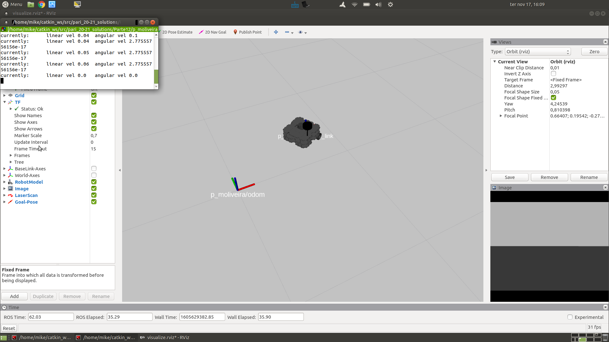

= Parte 13 - PSR

Miguel Riem Oliveira <mriem@ua.pt>
2021-2022

// Instruções especiais para o asciidoc usar icons no output
:icons: html5
:iconsdir: /etc/asciidoc/images/icons
:stem: latexmath

.Sumário
-------------------------------------------------------------
Localização
Hodometria
SLAM
Navegação
-------------------------------------------------------------

A localização é o processo através do qual o robô é capaz de estimar a sua posição no mundo.
Existem várias formas de realizar localização, desde algumas simples até outras bastante mais complexas.

Uma das formas mais utilizadas de localização é a hodometria. Este método consiste integração do movimento do robô ao longo do tempo por forma a obter uma posição atual (em ROS tipicamente representadas pelo sistema de coordenadas chamado _/base_footprint_ ou _/base_link_),
em relação a uma posição inicial (em ROS representada por um sistema de coordenadas designada por _/odom_).
Uma vez que a hodometria apenas faz a localização em relação a uma posição inicial, é chamado um sistema de localização relativo (a essa posição inicial).
Por oposição, um sistema GPS é um sistema de localização absoluto.

Um paralelismo interessante é a forma como um pirata segue as instruções num mapa do tesouro, por exemplo: Partindo da àrvore grande (posição inicial) e virado para sul (orientação inicial),
dá 30 passos (deslocamento relativo). Depois, vira para a esquerda (rotação relativa). Caminha mais 15 passos.
Estas instruções são na sua mairia relativas, i.e., só são consistentes se se tiver em conta a posição em relação à qual se referem.

A hodometria funciona de modo similar. Sabendo o raio das rodas de um robô, e sabendo a velocidade de rotação
das mesmas é possível saber qual foi o deslocamento por volta da roda (equivalente ao perímetro). A duas dimensões é necessário utilizar modelos cinemáticos mais complexos que são dependentes
da configuração do robô. Neste caso estamos a utilizar um robô diferencial, quer dizer, que tem duas rodas paralelas com atuação independente.

================
Aqui um https://www.youtube.com/watch?v=aE7RQNhwnPQ[tutorial interessante] sobre modelos diferenciais para robôs.
================

Exercício 1 - Visualização da odometria do robô
-----------------------------------------------

Lance o seu robô (último exercício da Parte12) e visualize a árvore de transformações.

[.text-center]
.Os sistemas de coordenadas com a hodometria do robô.

Lance também o RViz e visualize estes sistemas de coordenadas.

[.text-center]
.Visualização do sistema de coordenadas em RViz.

================
Para conseguir visualizar o robô tem de selecionar na opção fixed frame do RViz um sistema de coordenadas que esteja ligado ao robô.
Recomenda-se a seleção do sistema **/<player_name>/odom**.
================

Exercício 2 - Outros sistemas de localização
--------------------------------------------

Como falado atrás, a hodometria é um sistema de localização relativamente simples. Tem no entanto alguns problemas por ser um sistema incremental.
Erros nas estimativas de deslocamento vão-se acumulando ao longo do tempo.

Os métodos Simultaneous Localization and Mapping (SLAM) fazem a localização do robô usando para
isso uma descrição da cena, o mapa, que é atualizado em simultâneo. Assim, o robô, à medida que percorre o cenário,
vai-se localizando no mapa construído até ao momento, e essa localização serve por outro lado para atualizar o próprio mapa.

Existem vários algoritmos de SLAM usando diferentes sensores. Os mais simples empregam LiDARs 2D, como é o caso do
http://wiki.ros.org/gmapping[gmapping].

================
Instale o gmapping com o comando:

   sudo apt-get install ros-noetic-gmapping
================

O gmapping funciona expandindo a árvore de transformações de modo a inserir um sistema de coordenadas **map** que liga ao **odom**.
Deste modo é possível combinar as estimativas da hodometria (transformações do **odom** para o **base_footprint**) com
as do SLAM (transformações do **map** para o **odom**).

[.text-center]
.Visualização do sistema de coordenadas expandido pelo gmapping.

Neste exercício pretende-se utilizar o pacote **gmapping** para fazer SLAM à medida que se teleopera o robô pelo cenário da casa do turtlebot.
Estude o software  http://wiki.ros.org/gmapping[gmapping] e tente colocar a funcionar.

================
O que se pretende é algo semelhante ao que está neste https://youtu.be/tCvMIDy8Sf8[vídeo].
================

Exercício 3 - Multiplos robôs em cena
-------------------------------------

Faça as alterações necessárias para que seja possível ter vários robôs a serem
simultâneamente simulados pelo Gazebo. Pense em várias instanciações do seu **bringup.launch**, que deve aceitar como
argumentos de entrada o nome e a cor do robô.

Exercício 4 - How to cheat ... extrair a localização do Gazebo
--------------------------------------------------------------

O ambiente de simulação que estamos a utilizar é bastante realista.
No mundo real, um robô a navegar num ambiente não tem informação acerca da localização
de outros robôs. No entanto, e uma vez que o Gazebo simula todos os robôs e terá necessariamente de ter esta informação para operacionalizar a simulação,
é possível recolher essa informação do Gazebo (mensagens /gazebo/model_states) e transformá-la em mensagens tf de ROS.

Implemente um nó _model_states_to_tf.py_, dentro de um novo package **<player_name>_core**,
que faça esta conversão.

================
Para evitar colisões com a hodometria do controlador deve desligar a publicação das mensagens **tf** enviadas pelo
controlador diferencial em função da hodometria do robô.

Procure a opção **publishOdomTF** no ficheiro xacro de gazebo do turtlebot.
================

.Árvore de transformações antes de lançar o nó _model_states_to_tf.py_

.Árvore de transformações depois de lançar o nó _model_states_to_tf.py_
image::docs/tf_after_cheating.png[]

Aqui pode ver um https://youtu.be/mlGvgTpNJ_g[vídeo] com o sistema a funcionar.

Exercício 5 - Criação de um package para condução automática do robô
--------------------------------------------------------------------

Dentro do package **<player_name>_player** crie um nó python denominado **driver**, cujo papel é comandar o robô de forma automática.
Para conduzir o robô várias estratégias poderão ser implementadas, por exemplo movimento aleatório ou o seguimento de um alvo.
Para começar faça com que o nó player conduza imponha uma velocidade angular constante de -1 rad/s e velocidade linear nula.
O robô deve rodar continuadamente no sentido dos ponteiros do relógio.

Exercício 6 - Seguimento - planeamento de movimento simples
-----------------------------------------------------------

A ideia é o robô seguir para um local definido pelo utilizador. Aqui um https://www.youtube.com/watch?v=fymZY--pbZk[exemplo de seguimento de um robô por outro].

Vamos utilizar uma funcionalidade do RViz que permite publicar uma pose desenhando uma seta no programa (opção set 2D Goal).

.Funcionalidade _set 2D Goal_ no rviz.

================
Uma _pose_ é a definição a  6DOF, translação e rotação.
================

Quando se posiciona a seta, é publicada uma mensagem com a _pose_ da seta no referêncial selecionado no RViz (recomenda-se a utilização do _world_).

O nó **driver** deve subscrever o tópico _/<player_name>/move_base_simple/goal_ e dirigir o robô para esse ponto no espaço.
O robô deve assim perseguir a posição da seta, movendo-se para o local onde foi desenhada.

================
Deve fazer o remapeamento necessário para fazer o push do namespace do seu <player_name> na mensagem _goal_.
================

