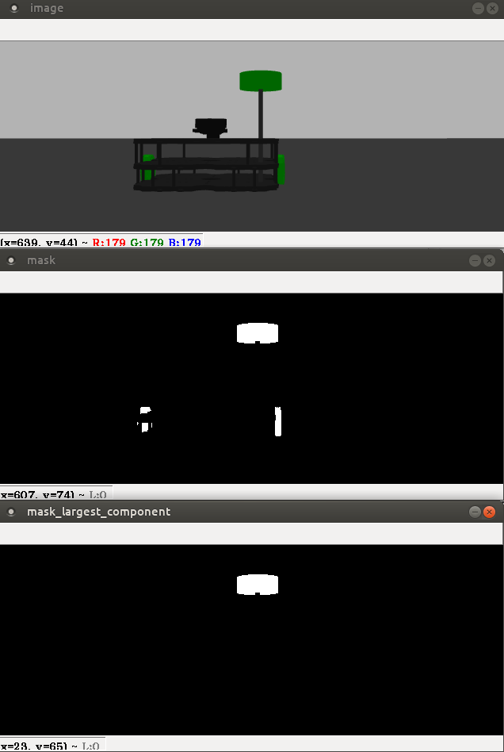

= Parte 14 - PARI

Miguel Riem Oliveira <mriem@ua.pt>
2020-2021

// Instruções especiais para o asciidoc usar icons no output
:icons: html5
:iconsdir: /etc/asciidoc/images/icons
:stem: latexmath

.Sumário
-------------------------------------------------------------
O jogo Team Hunt
-------------------------------------------------------------

Exercício 1 - Configurar o controlador do gazebo
-----------------------------------------------

Prepare os ficheiros de configuração do robô para utilizar o controlador do Gazebo, que é menos pesado que o de ROS, uma
vez que serão lançados vários robôs e terão de ser executados em simultâneo vários controladores para cada robô.

Exercício 2 - Launch file para o jogo
-------------------------------------

Crie um ficheiro game_bringup.launch que inicia três equipas: **Red**, **Green** e **Blue**, cada uma para já com apenas um jogador.

[TIP]
=========================================================================
Pode colocar mais do que um jogador por equipa, mas o sistema pode ficar pesado. Pelo menos durante a fase de testes recomenda-se ter um sistema rápido e ágil para maximizar
o número de testes que podem ser feitos.
=========================================================================

Utilize o empty world do Gazebo e coloque os robôs afastados uns dos outros, por exemplo:

.Posições iniciais dos jogadores
|===
|Nome jogador | Equipa | x inicial | y inicial

| red1 | Red | 5 | 5
| red2 | Red | 6 | 5
| red3 | Red | 7 | 5
| green1 | Green | -5 | 5
|blue1 | Blue | -5 | -5
|===

Crie também um ficheiro de parâmetros em **<player_name>_bringup/params/game.yaml** que contenha
o nome dos jogadores, i.e.:

.Parâmetros ros para configuração do jogo.
[source,yaml]
--------------------------------------------------------
red_players: ["red1", "red2", "red3"]
green_players: ["green1", "green2", "green3"]
blue_players: ["blue1", "blue2", "blue3"]

game_duration: 80
immunity_duration: 3
killed_duration: 6
positive_score: 1
negative_score: -1
best_hunter_score: 5
best_survivor_score: 5
--------------------------------------------------------

Pode depois ler os parâmetros diretamente no launch file com a linha no _launch file_:

    <rosparam command="load" file="$(find <player_name>_bringup)/params/game.yaml"/>

Exercício 3 - Qual é a minha equipa?
------------------------------------

Implemente uma nova funcionalidade no nó *driver** que deve ser executada na fase de inicialização
e que permite ao nó perceber qual é a sua equipa em função do nome do jogador, que deve estar _hardcoded_ no nó,
e da lista de jogadores das equipas que devem ser lidas dos parâmetros ros (ver Exercício 2).

[TIP]
=========================================================================
Recorde http://wiki.ros.org/rospy_tutorials/Tutorials/Parameters[este tutorial sobre parâmetros ROS].
=========================================================================

Exercício 4 - Configuração das equipas
--------------------------------------

Extenda a funcionalidade do exercício anterior de modo a que seja possível ao código ter acesso às cores das equipas:

1. _my_team_ a cor da equipa a que o jogador pertence
2. _prey_team_ a cor da equipa que está a ser caçada pelo jogador
3. _hunter_team_ a cor da equipa que está a caçar o jogador

O programa deve logo no início imprimir uma mensagem com toda esta informação. Por exemplo, o comando:

    rosrun p_moliveira_core p_moliveira __name:=blue3

imprime para o ecrã:

    My name is blue3. I am team blue I am hunting ['red1', 'red2', 'red3'] and fleeing from ['green1', 'green2', 'green3']

Exercício 5 - Modo de perseguição
---------------------------------

Crie no nó **driver** um subscritor da mensagens de imagem do robô. Depois faça o processamento necessário para segmentar
a cor da equipa presa. Use a localização das manchas de cor na imagem para definir o ângulo de direção do robô e assim
guiá-lo em direção à presa.

[TIP]
=========================================================================
Pode ser útil alterar os parâmetros da imagem nos ficheiros de configuração do
robô de modo a ter uma imagem mais larga, mais to tipo _widescreen_.
=========================================================================

[.text-center]
.Sistema de procura do jogador presa por deteção de cor.

Outra solução é tentar derivar a posição do robô presa usando imagem e dados do Lidar, de modo a criar um goal
semelhante ao que se fazia em RViz.

[TIP]
=========================================================================
Para utilizar dados Lidar terá adicionar um objeto mais largo ao robô de modo a que o Lidar consiga recolher dados.
=========================================================================

Exercício 6 - Colisões em Gazebo
--------------------------------

Uma das funcionalidades bastante interessantes do Gazebo é a a capacidade de detetar colisões entre os objetos (e os componentes desses objetos)
que estão colocados no mundo. Note que quando lança o seu robô, mesmo que no _empty world_ do Gazebo, o robô fica sempre no plano XoY.
Isto é porque há um objeto chamado _ground_ que é um plano Z=0. Os robôs não caiem por gravidade porque o Gazebo deteta uma
colisão entre o robô e o objeto _ground_.

Pode verificar todas as colisões que o gazebo está a detetar usando um sistema de mensagens semelhante ao ROS:

    gz topic -l

para listar todos os tópicos. E o tópico relevante para este caso é:

    gz topic -e /gazebo/default/physics/contacts

Aqui podem ver-se várias deteções a serem efetuadas continuamente pelo Gazebo.

.Resultado do comando **gz topic -e /gazebo/default/physics/contacts**.
[source,yaml]
--------------------------------------------------------
contact {
  collision1: "green1::wheel_right_link::wheel_right_link_collision"
  collision2: "ground_plane::link::collision"
  position {
    x: 1.0005028043174486
    y: -0.15296809099677811
    z: -0.0010149050861694986
  }
  position {
    x: 1.0005021678464576
    y: -0.13496809668199061
    z: -0.001000613042155013
  }
  normal {
    x: 0
    y: 0
    z: 1
  }
  normal {
    x: 0
    y: 0
    z: 1
  }
  depth: 0.0010149050861694986
  depth: 0.001000613042155013
  wrench {(...)}
}
time {
  sec: 956
  nsec: 745000000
}
--------------------------------------------------------

Uma colisão ocorre sempre entre dois objetos, cujos nomes estão listados nos campos _collision1_ e _collision2_.
Também são disponibilizadas outras informações como a posição onde ocorre a colisão e o tempo em que ocorreu.

Exercício 4 - Sensor de Contacto
--------------------------------

Como já vimos anteriormente, para jogar o **Team Hunt** é necessário que seja possível detetar quando um jogador caçador
apanha um jogador presa. Para fazer isto, vamos configurar um sensor de contacto que irá simular um _bumper_.
Os _bumper sensors_ são sensores mecânicos que servem para detetar uma colisão entre o sensor e um objeto físico.
Aqui um https://www.vexrobotics.com/276-2159.html[exemplo].

Para criar um sensor é necessário acrescentar à descrição do robô (o ficheiro xacro) a seguinte informação:

.Campo com sensor de contacto a acrescentar à descrição do robô.
[source,xml]
--------------------------------------------------------
<gazebo reference="base_link">
    <sensor name="base_link" type="contact">
      <update_rate>1000.0</update_rate>
      <always_on>true</always_on>
      <contact>
        <collision>base_footprint_fixed_joint_lump__base_link_collision_collision</collision>
      </contact>
      <plugin name="base_link_contact_sensor_plugin" filename="libgazebo_ros_bumper.so">
        <bumperTopicName>contact</bumperTopicName>
        <frameName>world</frameName>
      </plugin>
    </sensor>

  </gazebo>
--------------------------------------------------------

O sensor de contacto é assim um detetor de colisões especialmente dedicado à colisão entre um _link_ e um qualquer outro objeto.

O plugin _libgazebo_ros_bumper.so_ serve para traduzir para ROS as colisões detetadas por este sensor. Será publicada uma
mensagem ROS no tópico contact (com um push para o namespace do robô).

[TIP]
=========================================================================
O nome da _collision_ a colocar não é arbitrário. Será o nome que a colisão terá quando o ficheiro xacro for processado,
transformado primeiro para **urdf** e posteriormente para **sdf**. Para verificar o nome que deve colocar faça manualmente esta
conversão com os comandos:

    roscd <player_name>_description/urdf
    rosrun xacro xacro --inorder <player_name>.urdf.xacro > <player_name>.urdf
    gz sdf -p <player_name>.urdf > <player_name>.sdf

Verifique depois no ficheiro <player_name>.sdf o nome da colisão a colocar deve ser o que está neste ficheiro.

Mais informação https://answers.gazebosim.org//question/20432/ros-gazebo-detecting-collision-with-a-static-object-using-contact-sensor/[aqui].

=========================================================================

Depois de corretamente configurado deverá, depois de lançar o sistema, ter um tópico
**/<player_name>/contact** para cada jogador.

faça _rostopic echo_ destas mensagens e experimente conduzir o robô e fazer com que este bata num outro objeto, e verifique que
as mensagens de contacto dão essa informação.

As mensagens recebidas são do tipo http://docs.ros.org/en/jade/api/gazebo_msgs/html/msg/ContactsState.html[gazebo_msgs/ContactsStates]

.Resultado com comando **rostopic echo /<player_name>/contact**.
[source,yaml]
--------------------------------------------------------
header:
  seq: 20686
  stamp:
    secs: 223
    nsecs: 430000000
  frame_id: "red1/world"
states:
  -
    info: "Debug:  i:(0/1)     my geom:green1::base_footprint::base_footprint_fixed_joint_lump__base_link_collision_collision\
  \   other geom:red1::base_footprint::base_footprint_fixed_joint_lump__base_link_collision_collision\
  \         time:223.429000000\n"
    collision1_name: "green1::base_footprint::base_footprint_fixed_joint_lump__base_link_collision_collision"
    collision2_name: "red1::base_footprint::base_footprint_fixed_joint_lump__base_link_collision_collision"
    wrenches: (...)
    contact_positions:
      -
        x: 1.02151025674
        y: 0.148235936311
        z: 0.102451477472
      -
        x: 1.02174512877
        y: 0.148234386897
        z: 0.00920771314588
      -
        x: 1.01999703964
        y: -0.148956422115
        z: 0.00920824824236
      -
        x: 1.01976216738
        y: -0.148954764468
        z: 0.102452357523
    contact_normals:
      -
        x: 0.999979529242
        y: -0.00588182787918
        z: 0.0025189676055
      -
        x: 0.999979529242
        y: -0.00588182787918
        z: 0.0025189676055
      -
        x: 0.999979529242
        y: -0.00588182787918
        z: 0.0025189676055
      -
        x: 0.999979529242
        y: -0.00588182787918
        z: 0.0025189676055
    depths: [3.483560259698315e-08, 3.314701102485884e-08, 6.3319008092310725e-09, 8.020508424078088e-09]
--------------------------------------------------------

Aqui um https://youtu.be/iyXNydU5ZhQ[vídeo do que se pretende].

