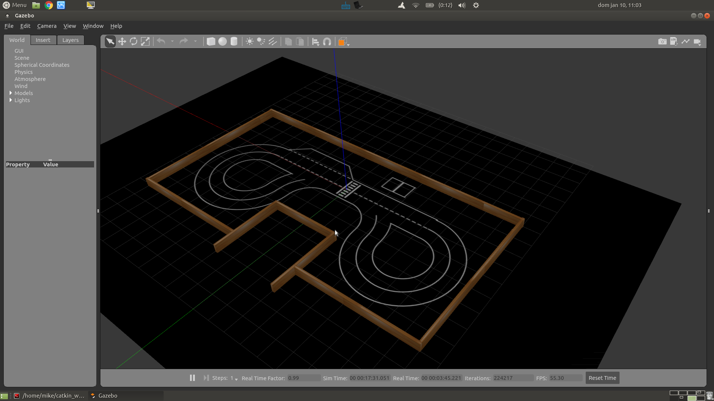

= Parte 15 - PARI

Miguel Riem Oliveira <mriem@ua.pt>
2020-2021

// Instruções especiais para o asciidoc usar icons no output
:icons: html5
:iconsdir: /etc/asciidoc/images/icons
:stem: latexmath

.Sumário
-----------------
O àrbitro do jogo
-----------------

Exercício 1 - Team Hunt Arena
-----------------------------

No repositório está uma diretora chamada **TeamHunt**. Aqui, um pacote ROS chamado
th_description contém os ficheiros necessários para lançar a arena do jogo.
A arena consiste na pista utilizada anteriormente mas com uma cerca a toda a volta que impede que os robôs consigam fugir dos seus caçadores
sempre na mesma direção.

.Arena de jogo

Para lançar esta arena de jogo basta chamar este _world_ no ficheiro de bringup **gazebo_bringup.launch**, alterando o argumento para:

.**gazebo_bringup.launch** atualizado com a arena do jogo.
[source,xml]
--------------------------------------------------------
<launch>
    <!-- <arg name="world" default="$(find turtlebot3_gazebo)/worlds/empty.world"/>-->
    <arg name="world" default="$(find th_description)/worlds/th_arena.world"/>
    <!--    <arg name="world" default="$(find turtlebot3_gazebo)/worlds/turtlebot3_house.world"/>-->
    <!--    <arg name="world" default="$(find _fnr)/worlds/fnr.world"/>-->

    (...)
</launch>
--------------------------------------------------------

Exercício 2 - O àrbitro
-----------------------

Uma vez que é preciso ter sempre alguém
[.line-through]#que se possa insultar livremente# que verifique se as regras do jogo estão a ser cumpridas,
é necessário que alguma entidade desempenhe este papel.

O nó **th_referee** é um programa responsável por verificar continuamente vários parâmetros do jogo.
Um dos principais parâmetros é a colisão entre um caçador e uma presa, que é o evento que atribuí pontos à equipa do caçador, e retira pontos à equipa da presa.

Por não haver tempo suficiente o àrbitro é dado já desenvolvido, cabendo aos alunos integrar este software
na sua framework de modo a conseguir executar jogos de **Team Hunt**.

Recomenda-se que este nó seja executado num terminal separado por forma a ser o único programa a imprimir para o terminal,
visto que este nó imprime o score do jogo ao longo do tempo.

Este https://youtu.be/3RablFrylyw[vídeo] mostra o jogo com o àrbitro operacional.